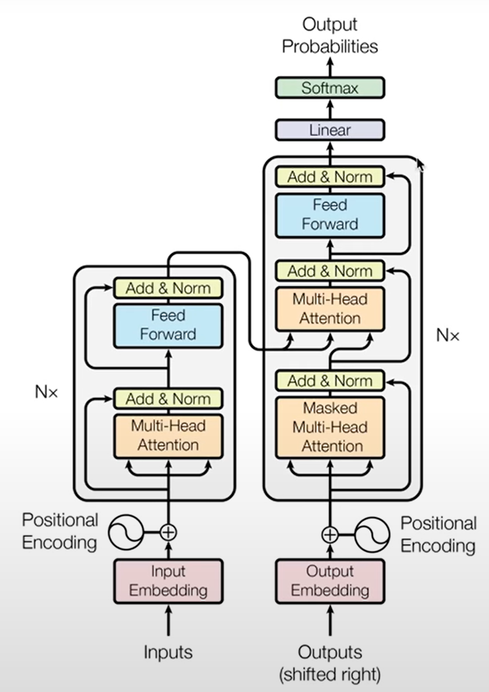
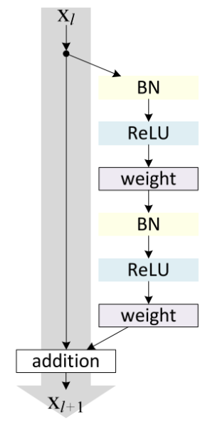
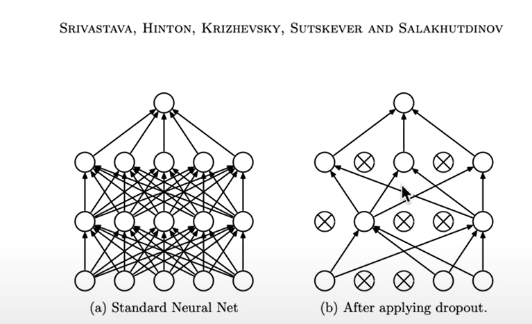

# NanoGPT with Simple Interpretability

1. **Extract Attention Weights**: After you run your input through the model, you can extract the attention weights. These weights are part of the model's internal state, and they essentially show how much the model "paid attention" to each input token when generating each output token.

2. **Visualize Attention Weights**: You can then visualize these weights as a heatmap, where the x-axis represents input tokens, the y-axis represents output tokens, and the color of each cell represents the attention weight.

If a particular input token has high attention weights across many output tokens, that suggests it was important in generating the output.


<div align="center">
    
</div>

# Training Data
Use text file containing shakespeare poems
```python
! wget https://raw.githubusercontent.com/karpathy/char-rnn/master/data/tinyshakespeare/input.txt
with open('input.txt', 'r', encoding='utf-8') as f:
    text = f.read()
```

Use a 90/10 train/val split
```python
data = torch.tensor(encode(text), dtype=torch.long)
n = int(0.9*len(data))
train_data = data[:n]
val_data = data[n:]
```

Data loading method to get batch of training text and label. Shape of x and y are both (batch_size, context_length) where context length is an arbitrary number we choose. The model will be trained to predict up to context_length (1 char, 2 char, ..., context_length char). 

Note that `y` is length `context_length+1` because there are `context_length` number of examples packed and the `context_length`th example needs to predict the next token (+1). This means for each `y`, the model is trained to predict the next token when the input only has 1, 2, 3, ..., `context_length` number of tokens. 

- `batch_size` sets how many independent sequences will be processed in parallel.

- `context_length` is max contenxt length for predictions

- `ix` contains randomly generated `batch_size` numbers of offsets between `0` and `len(data) - context_length`. Now we can sample from our randomized set of `ix` training data.

- `x` sample a point from `ix` and take the next `context_length` to represent one trianing data example. Stack examples in `batch_size`x`context_length` tensors 

- `y` represents target values (i.e label). Based on the same `ix` sampling, take the next token (`i+1`) which is what the model needs to predict 

```python
batch_size = 4 
context_length = 8 

def get_batch(split):
    data = train_data if split == 'train' else val_data
    ix = torch.randint(len(data) - context_length, (batch_size,)) 
    x = torch.stack([data[i:i+context_length] for i in ix])
    y = torch.stack([data[i+1:i+context_length+1] for i in ix])
    x, y = x.to(device), y.to(device)
    return x, y
```

# Vocabulary

Create maps for string to int `stoi` and int to string `itos` by getting unique chars in training data

```python
chars = sorted(list(set(text)))
vocab_size = len(chars)
```

Then map chars to integers (idx)
```python
stoi = { ch:i for i,ch in enumerate(chars) }
itos = { i:ch for i,ch in enumerate(chars) }
encode = lambda s: [stoi[c] for c in s] 
decode = lambda l: ''.join([itos[i] for i in l]) 
```

Encode: string -> list of ints

Decode: list of ints -> string

# High-level Overview

1. Input embedding: converts categorical data (tokens) into a form that can be processed by a model (vector). This embedding is simultaneously trianed during the transformer training process, and its goal is to arrange the embeddings in the vector space in such a way that semantically similar words are cloes to each other. The `n_embed` hyperparameter determines the complexity of the embedding.

2. Positional encoding: similar to input/token embedding, the positional embedding provides positional information of each token in the input sequence (similar to how RNN learns momentum). For example, "dog bites man" has different meaning than "man bites dog". In the original transformer paper, positional embeddings are added to the token emebeddings to create a single input representation that includes information about both token and position of the input.

3. Multi-head self-attention (Nx transformer blocks): can be seen as data communication followed by computation (need time to "think" on the data communication)

4. Last layer norm: stabilizes the network (stable training, incremental progress) 

5. Last linear layer: output of final pointwise FNN goes through final linear layer which acts as a classifier (clasifier is as big as how many classes you have ⇒ i.e size 10k = 10k word vocab). 

6. Cross-entropy loss function: This function first applies a softmax function to the logits, converting them into probabilities that are positive and sum to 1. It then computes the negative log likelihood loss. Taking the log of the probability, which ranges from 0 to 1, results in a negative value. To ensure a positive loss function, we use negative log likelihood (NLL). This approach also provides a heavy penalty for high confidence in incorrect predictions, making it beneficial for the model's accuracy. The smaller the loss, the better the model's performance.

The final output is a probability score for each class (each unique token) which also means the output is the same size as the vocabulary (probabilitiy for each unique token). On inference, the model takes the highest probable word as the "next predicted word"

Note: `(B,T,C)` = (Batch, Time, Channel) = (Batch, Position, n_embed or vocab_size)

Note: logits has shape `(B,T,C)` but pytorch cross_entropy takes in `(B,C,T)`. So we reshape our logits to be a 2D array of `(B*T, C)` but preserve C dimension. We also reshape our target to `B*T`

```python
class BigramLanguageModel(nn.Module):

    def __init__(self):
        super().__init__()
        self.token_embedding_table = nn.Embedding(vocab_size, n_embd)
        self.position_embedding_table = nn.Embedding(context_length, n_embd)
        self.blocks = nn.Sequential(*[Block(n_embd, n_head=n_head) for _ in range(n_layer)])     
        self.ln_f = nn.LayerNorm(n_embd)
        self.lm_head = nn.Linear(n_embd, vocab_size)

    def forward(self, idx, targets=None):
        B, T = idx.shape

        # 1. input embedding
        tok_emb = self.token_embedding_table(idx) # (B,T,n_embed)

        # 2. positional encoding
        pos_emb = self.position_embedding_table(torch.arange(T, device=device)) # (T,n_embed)
        x = tok_emb + pos_emb # (B,T,n_embed)

        # 3. multi-head self-attention (Nx transformer blocks) 
        x = self.blocks(x) # (B,T,n_embed)

        # 4. last layer norm
        x = self.ln_f(x) # (B,T,n_embed)

        # 5. last linear layer
        logits = self.lm_head(x) # (B,T,vocab_size)

        # 6. Cross-entropy loss function (softmax)
        B, T, C = logits.shape 
        logits = logits.view(B*T, C)
        targets = targets.view(B*T)
        loss = F.cross_entropy(logits, targets)

        return logits, loss
```

# Transformer Block (Nx)

Self-attention is data communication. Feed forward is data computation (think on all the tokens independently). 

Note: although the original paper applies the layer norm after the self-attention and feed forward layers, modern implementaiton of transformers use pre-norm formulation where the layer norm is applied before the self-attention and feed forward layers.   

```python
class Block(nn.Module):
    def __init__(self, n_embd, n_head):
        super().__init__()
        head_size = n_embd // n_head 
        self.sa = MultiHeadAttention(n_head, head_size)
        self.ffwd = FeedFoward(n_embd)
        self.ln1 = nn.LayerNorm(n_embd)
        self.ln2 = nn.LayerNorm(n_embd)

    def forward(self, x):
        x = x + self.sa(self.ln1(x)) 
        x = x + self.ffwd(self.ln2(x))
        return x
```


# !!! Self-Attention !!!


```python
class Head(nn.Module):
    def __init__(self, head_size):
        super().__init__()
        self.key = nn.Linear(n_embd, head_size, bias=False)
        self.query = nn.Linear(n_embd, head_size, bias=False)
        self.value = nn.Linear(n_embd, head_size, bias=False)
        self.register_buffer('tril', torch.tril(torch.ones(context_length, context_length))) # add a persistent buffer (self.tril) to the nn.module which will not be updated during backpropagation

        self.dropout = nn.Dropout(dropout)

    def forward(self, x):
        B,T,C = x.shape
        k = self.key(x)   # (B,T,C)
        q = self.query(x) # (B,T,C)
        # compute attention scores ("affinities")
        wei = q @ k.transpose(-2,-1) * C**-0.5 # (B, T, C) @ (B, C, T) -> (B, T, T)
        wei = wei.masked_fill(self.tril[:T, :T] == 0, float('-inf')) # (B, T, T)
        wei = F.softmax(wei, dim=-1) # (B, T, T)
        wei = self.dropout(wei)
        # perform the weighted aggregation of the values
        v = self.value(x) # (B,T,C)
        out = wei @ v # (B, T, T) @ (B, T, C) -> (B, T, C)
        return out
```

Multi-head self-attention is 
```python
class MultiHeadAttention(nn.Module):
    """ multiple heads of self-attention in parallel """

    def __init__(self, num_heads, head_size):
        super().__init__()
        self.heads = nn.ModuleList([Head(head_size) for _ in range(num_heads)]) # multiple heads in parallel
        self.proj = nn.Linear(n_embd, n_embd) # residual connection
        self.dropout = nn.Dropout(dropout)

    def forward(self, x): # run heads in parallel and concatenate them together in the channel dimension
        out = torch.cat([h(x) for h in self.heads], dim=-1) # output of self-attention
        out = self.dropout(self.proj(out)) # apply projection (projection back into residual pathway). Projection is just a linear transformation of the output of self-attention
        return out
```

# Addressing Optimization Issues:
In *deep* neural networks, especially deep NNs using sigmoid or tanh activations, the gradients can become very small. This is because the derivative of these functions is less than or equal to 1, so when you multiply these small numbers together through many layers during backpropagation, the gradient can decrease exponentially and approach zero. This is called the **vanishing gradient problem** and it makes learning in the early layers very slow or impossible, as the gradients that are backpropagated during training become increasingly small. Another problem is the **information bottleneck**, where the input data gets diluted or lost as it passes through so many layers with random weights and the input data gets lost by the time it reaches the later layers. This can make it difficult for the network to learn complex patterns in the data.

### Residual Nets
ResNets address the vanishing gradient with skip connections, which allow the gradient to be directly backpropagated to earlier layers (backpropagates through both regular pathway and skip connections, not one or the other). The network is divided into residual blocks (regular computation is done here), and each block has a skip connection that bypasses one or more layers. The output of the block is the addition of the input and the output of the layers bypassed by the skip connection. Addition operation is crucial because it allows the gradient to be equally distributed to both branches during backpropagation. The **job of the residual block is no longer to figure out everything important about the input that needs to be passed along but rather what information it can add on top of the input to make the subsequent processing easier**. This makes the task of each block simpler and allows it to have access to better information (the original data and the output of the previous residual block). The gradients can also take these shorter paths, which means passing useful gradients back to the earlier layers more quickly. To summarize: 
- skip connections help mitigate the vanishing gradient problem by providing an additional pathway for the **gradient to flow through** during backpropagation so that **the earlier layers** can receieve a substantial gradient update during backpropagation
- skip connections help mitigate the information bottleneck by allowing **input data to flow through** the skip connections and towards **the later layers** instead of the info getting diluted by the many layers of deep NN.

One potential issue with ResNets is shape mismatches between the input and the output of a residual block, since they need to be added together. This is typically addressed by using padding or projection shortcuts.




### Layer Norm
Very simialr to BatchNorm. Batch normalization makes sure that every column of input (each feature across different samples in a batch) has unit Gaussian distribution (0 mean and 1 sd). LayerNorm, does the same thing but for every row (each feature within a single sample). So, while BatchNorm normalizes across different samples, LayerNorm normalizes within a single sample. In general, BatchNorm works well for CNN with fixed-size inputs like images whereas LayerNorm works better for RNN where the input size changes at each time step

```python
class LayerNorm1d: 
  def __init__(self, dim, eps=1e-5, momentum=0.1):
    self.eps = eps
    self.gamma = torch.ones(dim)
    self.beta = torch.zeros(dim)

  def __call__(self, x):
    # calculate the forward pass
    xmean = x.mean(1, keepdim=True) # batch mean
    xvar = x.var(1, keepdim=True) # batch variance
    xhat = (x - xmean) / torch.sqrt(xvar + self.eps) # normalize to unit variance
    self.out = self.gamma * xhat + self.beta
    return self.out

  def parameters(self):
    return [self.gamma, self.beta]

module = LayerNorm1d(100)
x = torch.randn(32, 100) # batch size 32 of 100-dimensional vectors
x = module(x) # (32, 100)
```

### Dropout Layer
for every forward/backward pass, dropout layer shuts off some random subset of neurons (drops them to zero) and trains without them. Effectively, because the neurons are being dropped off randomly for every forward and backward pass, the neural net ends up training an ensemble of sub-networks. At test time, everything is fully enabled and all of those subnetworks are merged into a single ensemble. Remember that in classical ML, ensemble methods enhance accuracy by utilizing multiple independent networks — the most frequently selected output (through voting) is used as the final output. In essence, dropout layer is a regularization technique which is often used when scaling up a model and we want to fight overfitting.





# Training
Typical model training code. Get batch of data, evaluate loss, zero out gradients from optimizer, backpropagation, optimizer takes in gradient and update weights

```python
model = BigramLanguageModel()
optimizer = torch.optim.AdamW(model.parameters(), lr=learning_rate)

for iter in range(max_iters):
    xb, yb = get_batch('train')

    logits, loss = model(xb, yb)
    optimizer.zero_grad(set_to_none=True)
    loss.backward()
    optimizer.step()
```

# Inference
Take the last `context_length` tokens from the input (since positional embedding is only size `context_length`) and predict the next token. The next token processing returns a logits, which is then converted into a probability distribution via softmax function. Lastly, any token that passes a certain probability threshold is selected as the next token (in GPT models, this threshold is called temperature)

```python
class BigramLanguageModel(nn.Module):
    def generate(self, idx, max_new_tokens):
        B, T = idx.shape

        for _ in range(max_new_tokens):
            # take the last context_length tokens
            idx_cond = idx[:, -context_length:]

            # next token prediction
            logits, loss = self(idx_cond)
            logits = logits[:, -1, :] # (B,T,C) -> (B,C)
            probs = F.softmax(logits, dim=-1) # (B,C)

            # sample from the distribution
            idx_next = torch.multinomial(probs, num_samples=1) # (B,1)            
            idx = torch.cat((idx, idx_next), dim=1) # (B,T) -> (B,T+1)
        return idx
```

To generate text, start with token zero which is just a space character in our vocab. This is like our user prompt. 

```python
context = torch.zeros((1, 1), dtype=torch.long, device=device)

decode(model.generate(context, max_new_tokens=2000)[0].tolist()) # get 0th idx batch
```